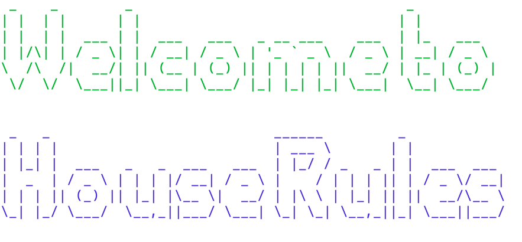
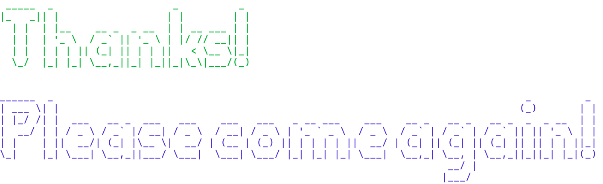

# House Rules

House Rules is a CLI application that is for reviewing and storing your table top games.



### Format 

CLI application created with Ruby, ActiveRecord, and TTY::Prompt, Color, and Font

## Instructions

1. Open your terminal
2. git clone https://github.com/evereichmann/ruby-project-guidelines-chi01-seng-ft-062220.git
3. cd ruby-project-guidelines-chi01-seng-ft-062220
4. bundle install 
5. type ruby bin/run.rb
6. follow the commands

### Creators:
- Haley Ferro
  -contact: haleyvferro@gmail.com
- Eve Reichmann
  -contact: eve.reichmann@gmail.com


```
